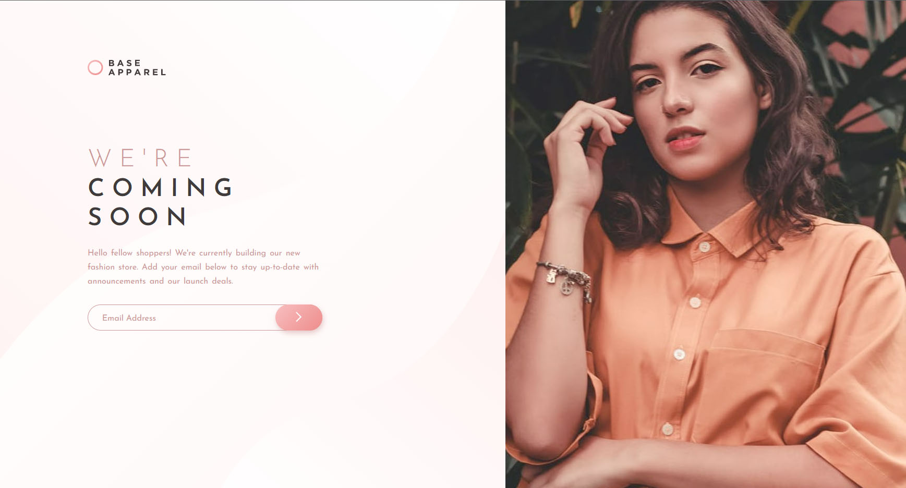
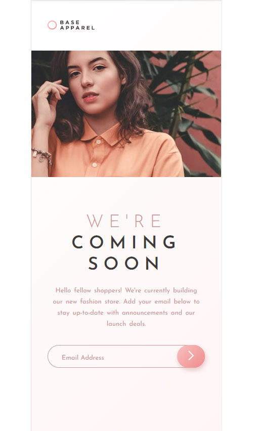

# Frontend Mentor - Base Apparel Coming Soon Page solution

This is a solution to the [Base Apparel Coming Soon Page Challenge on Frontend Mentor](https://www.frontendmentor.io/challenges/base-apparel-coming-soon-page-5d46b47f8db8a7063f9331a0) !

## Table of contents

- [Overview](#overview)
  - [The challenge](#the-challenge)
  - [Screenshot](#screenshot)
  - [Links](#links)
- [My process](#my-process)
  - [Built with](#built-with)
  - [What I learned](#what-i-learned)
  - [Continued development](#continued-development)
- [Author](#author)

## Overview

### The challenge

Users should be able to:

- View the optimal layout depending on their device's screen size
- See hover states for all interactive elements on the page
- Receive an error message when the form is submitted if:
  - The input field is empty
  - The email address is not formatted correctly

### Screenshots

### Links

- Solution URL: 
- Live Site URL: 

## My process

### Built with

- Semantic HTML5 markup
- CSS custom properties
- JavaScript Form validation

### What I learned

I had the chance to apply the basic of JavaScript coding for the email validation part. 

### Continued development

I need to practice more my JavaScript and also learn more about responsive site building.

## Author

- Website - [GitHub](https://github.com/AshashashR)
- Frontend Mentor - [@AshashashR](https://www.frontendmentor.io/profile/AshashashR)
